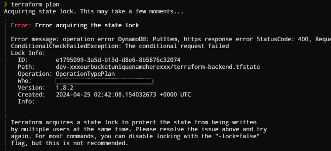
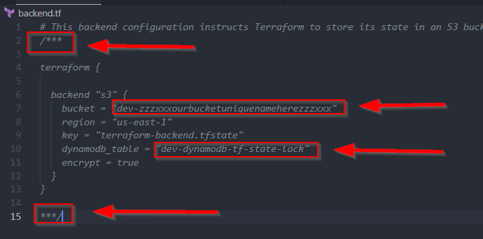

# Terraform Remote State Management, Versioning and State Locking with AWS S3 and DynamoDB
Welcome to the `tf-aws-rsvl` project. This project demonstrates how to set up a Terraform backend configuration option in Terraform that allows us to store and manage the state files of our infrastructure in a secure remote location with versioning and state locking using AWS S3 for remote storage and AWS DynamoDB for state locking. 

## What is a remote state?
By default, Terraform stores state files locally with the file named `terraform.tfstate`. When working with Terraform in a team, the use of a local file makes Terraform state management complicated because each time when users apply infrastructure changes they always have the latest state data locally stored on their machine. With remote state, Terraform writes the state data to a remote location, which can then be shared between all team members.

## What is versioning?
Terraform state versioning is a practice of keeping different versions of the Terraform state file. In case of accidental deletion or corruption, we can view and restore the state file from its previous versions.

## What is state locking?
Terraform state locking is a way to prevent users from concurrent edits to our state file. We use Terraform state locking to avoid making the Terraform state files get corrupted because two or more users might do the `terraform apply` command at the same time and this will be a problem. 

The screenshot below shows how this works when two people do terraform apply or terraform plan at the same time.

## Project Features
- **AWS S3 for State Storage**: Stores Terraform state files in a secure and durable S3 bucket.
- **AWS DynamoDB for State Locking**: Uses a DynamoDB table to lock the state file when it's being modified, preventing concurrent modifications.
- **Versioning**: Enables versioning on the S3 bucket to allow for state recovery in case of accidental deletions or modifications.
- **Server-Side Encryption**: Uses server-side encryption on the S3 bucket to protect your data at rest.

## Prerequisites
Before you begin, make sure you have the following:
1. Terraform installed on your local machine
2. An AWS account
3. IAM user account with permissions to create and delete S3 Bucket and DynamoDB.
4. AWS credentials of the IAM user configured in your environment or terminal. 
5. Basic knowledge of AWS, Terraform, S3, and DynamoDB

## How to use this project?

To deploy the infrastructure, follow these steps:

1. Clone this repository to your local machine.
2. Navigate to the directory containing the Terraform configuration files.
3. Modify the `variables.tf` to your preference and make sure to make the S3 bucket_name unique.
4. Modify the `dynamodb.tf` `read_capacity` and `write_capacity` value based on your preference. 
5. Initialize your Terraform workspace with `terraform init`.
6. Create a plan with `terraform plan`.
7. Apply the plan with `terraform apply`. This will provision the S3 bucket and DynamoDB.
8. Take note of the Output result of `dynamodb_table_name` and `s3_bucket_name` as we need to use the values to enter that into our Terraform backend configuration.
9. Then we move the local Terraform state remotely by modifying the `backend.tf` file and uncommenting and changing the values of `bucket` and `dynamodb_table` from the Output result we had on steps 7-8.

Screenshot below: 

10. Another `terraform init`, then our existing state will be copied to the remote S3 bucket we created earlier

## Notes
- If you wish to use this in a production environment it is recommended to modify the `dynamodb.tf` parameter `deletion_protection_enabled = false` to `true` to prevent accidental deletion of the dynamodb_table
- If you wish to delete the S3 Bucket and DynamoDB from terraform destroy command, make sure you uncomment the `force_destroy = true` from `s3.tf`, be careful and always review the destroy plan before saying yes.
 

## Contributing
Please feel free to modify this project and use this repo for your own needs.

## License
This project is distributed under the GNU General Public License (GPL) v3.0 License. 
See [LICENSE.txt](LICENSE.txt) for more information.

## Contact
If you have any questions or feedback, feel free to reach out.